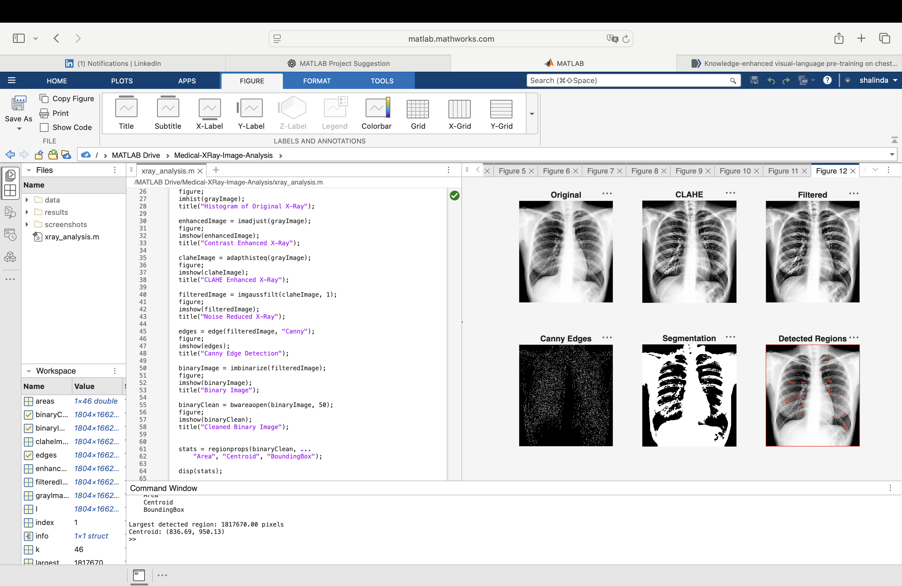

# Medical X-Ray Image Enhancement and Analysis Using MATLAB

## Overview

This project demonstrates a MATLAB-based image processing workflow
for enhancing and analyzing chest X-ray images.

The project was developed as a medical engineering portfolio project
to practice image processing techniques using MATLAB.

## Objectives

- Improve X-ray image contrast
- Reduce image noise
- Detect image edges
- Perform basic image segmentation
- Analyze connected regions
- Calculate basic image measurements

## Technologies

- MATLAB
- Image Processing Toolbox

## Image Processing Workflow

X-Ray Image
↓
Grayscale Conversion
↓
Contrast Enhancement
↓
CLAHE
↓
Gaussian Filtering
↓
Canny Edge Detection
↓
Image Segmentation
↓
Region Analysis

## Methods

### 1. Grayscale Conversion

The input X-ray image is converted from RGB to grayscale.

### 2. Contrast Enhancement

`imadjust` and `adapthisteq` are used to improve image contrast.

### 3. Noise Reduction

Gaussian filtering is applied to reduce image noise.

### 4. Edge Detection

The Canny method is used to identify intensity boundaries.

### 5. Image Segmentation

The processed image is converted into a binary image for
basic region analysis.

### 6. Region Analysis

`regionprops` is used to calculate properties such as:

- Area
- Centroid
- Bounding box

## Results

The project produces enhanced, filtered, edge-detected and segmented
versions of the X-ray image.

## Example Results

## How to Run

1. Open MATLAB.
2. Download or clone this repository.
3. Place the X-ray image inside the `data` folder.
4. Open `xray_analysis.m`.
5. Run the script.

## Project Structure

medical-xray-image-analysis-matlab/

├── xray_analysis.m

├── data/

├── results/

├── screenshots/

└── README.md

## Disclaimer

This project is intended for educational and image-processing
purposes only.

It is not a medical diagnostic system and should not be used
for clinical diagnosis.
